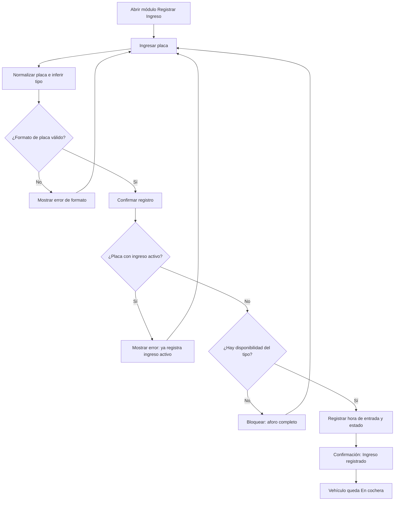

# Módulo Ingreso — Análisis y Diseño (UPAO-37)

> Historia: **UPAO-6 Registrar ingreso** · Subtarea **UPAO-37 (Análisis y Diseño)** · Sprint 1.

## 1. Objetivo

Definir los **campos requeridos** del registro de entrada de un vehículo, la **regla de validación del formato de placa** para autos y motos en Perú, y el **flujo** del registro.

## 2. Campos requeridos del registro de entrada

| Campo | Obligatorio | Origen | Detalle |
| --- | --- | --- | --- |
| **Placa** | Sí | Recepcionista | 6 caracteres alfanuméricos en MAYÚSCULAS; el guion lo inserta el sistema |
| **Tipo de vehículo** | Sí | Inferido de la placa + selector editable | Automóvil/Camioneta o Motocicleta |
| **Hora de entrada** | Automática | Sistema | Hora exacta al confirmar el registro; no editable |
| **Estado del espacio** | Derivado | Sistema | "Ocupado" al registrar el ingreso (permanece ocupado hasta la salida) |

> El recepcionista y la tarifa vigente del tipo de vehículo se asocian automáticamente al registrar.

## 3. Flujo del registro de ingreso

1. El recepcionista abre el módulo **Registrar Ingreso** (foco automático en Placa).
2. Ingresa la placa → el sistema la normaliza (MAYÚSCULAS + guion) e infiere el tipo de vehículo (selector visible y editable).
3. El sistema valida el formato de la placa (§4); si es inválido, muestra el error y no avanza.
4. El recepcionista confirma con **ENTER** o el botón "Registrar Ingreso".
5. El sistema verifica que la placa no tenga un ingreso activo.
6. El sistema verifica que exista disponibilidad para el tipo de vehículo.
7. El sistema registra la hora de entrada y el estado, y muestra la confirmación ("Ingreso registrado: Placa [ABC-123]").
8. El vehículo queda **En cochera** hasta que se registre su salida (UPAO-7).

## 4. Regla de validación del formato de placa (SUNARP / MTC)

| Tipo | Formato | Ejemplos | RegEx |
| --- | --- | --- | --- |
| Auto / Camioneta | 3 + 3 alfanuméricos | `ABC-123`, `A1B-234` | `^[A-Z0-9]{3}-?[A-Z0-9]{3}$` |
| Moto / Menores | 2 a 4 + 2 a 4 alfanuméricos | `1234-AB`, `AB-1234` | `^[A-Z0-9]{2,4}-?[A-Z0-9]{2,4}$` |

- **Normalización:** MAYÚSCULAS automáticas y guion automático (no se exige al usuario).
- **Inferencia del tipo:** si la placa inicia con letras (`ABC123`) se preselecciona **Auto/Camioneta**; si inicia con dígitos (`1234AB`) se preselecciona **Motocicleta**. El selector queda visible y editable.
- **Mensaje de error:** "Ingrese una placa válida según el formato peruano (ej. ABC-123 o 1234-5A)."

## 5. Referencias

- [Guía de Estilos y Lineamientos de Interfaz](../../diseño/Guía%20de%20Estilos%20y%20Lineamientos%20de%20Interfaz.md), §2.A (validaciones de placa).
- Modelo de datos: la tabla `estadia` ya contiene `placa`, `hora_ingreso` y `hora_salida`.

> El control de aforo (por totales y entradas activas) y la API se definen en UPAO-38 y UPAO-40.
